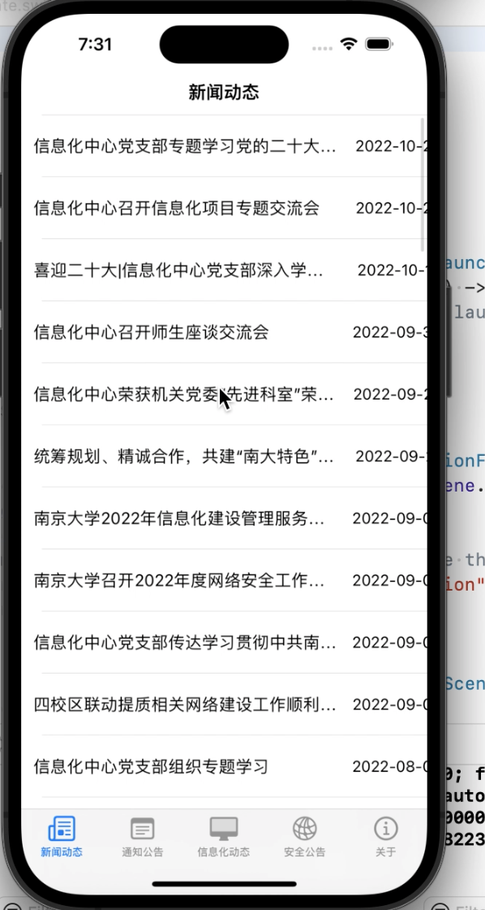
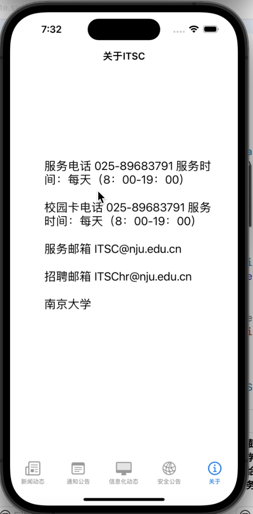

# IOS开发ITSC


## 一、效果展示

功能展示如下：

主界面



关于界面



结果展示：已经发到qq群里


二.过程

1、解析html文件问题

​	这里引入了SwiftSoup库，使用SwiftSoup来解析这一文件，然后利用里面提供的工具来提取我们需要的内容。（给出一点例子）

```swift
  let document = try SwiftSoup.parse(self.html)
  let title = try document.title()
  let pics: Elements = try document.select("img[src]")
```


2、访问url问题

​	利用的是URLSession来访问url，里面也适用了GCD并发编程来控制运行，代码如下：

```swift
let url = URL(string: news_item.website)!
let task = URLSession.shared.dataTask(with: url, completionHandler: {
  data, response, error in
  if let error = error {
    print("\(error.localizedDescription)")
    return
  }
  guard let httpResponse = response as? HTTPURLResponse,
  (200...299).contains(httpResponse.statusCode) else {
    print("server error")
    return
  }
  if let mimeType = httpResponse.mimeType, mimeType == "text/html",
  let data = data,
  let string = String(data: data, encoding: .utf8) {
    DispatchQueue.main.sync {
      self.html = string
      //print(string)
      self.loadContent()
    }
  }
})
task.resume()
```


## 三、感想与体会

​	这次实验是三次实验中最难的一次吧，因为没有教程，只能自己一点一点去学习，总体来说受益匪浅，在下一实验中也会继续学习。